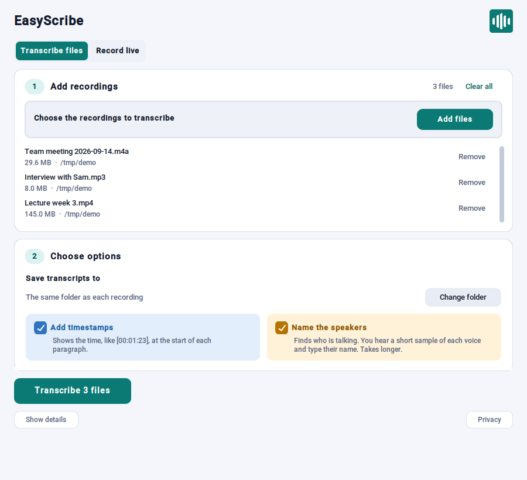
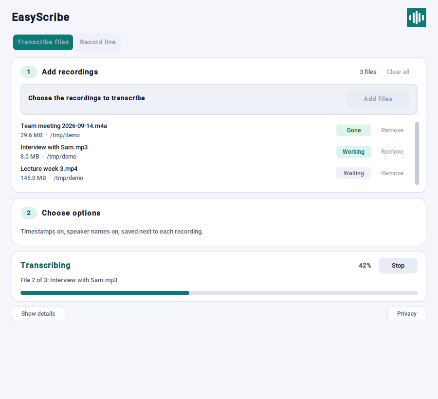
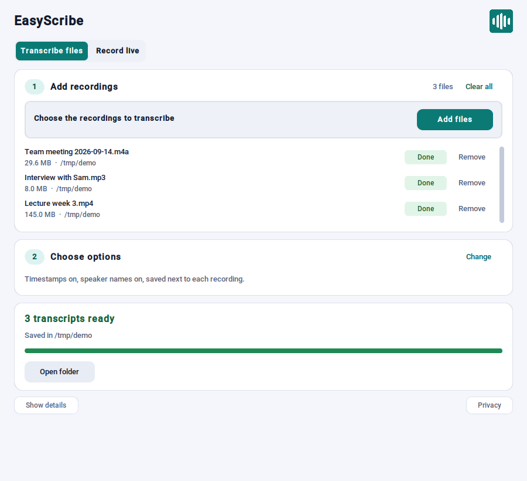
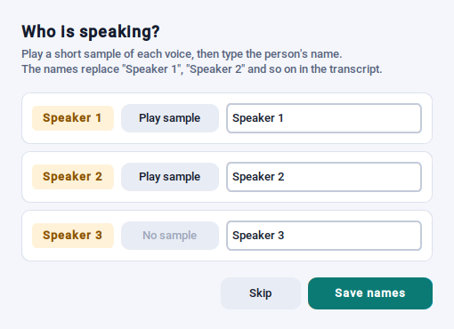
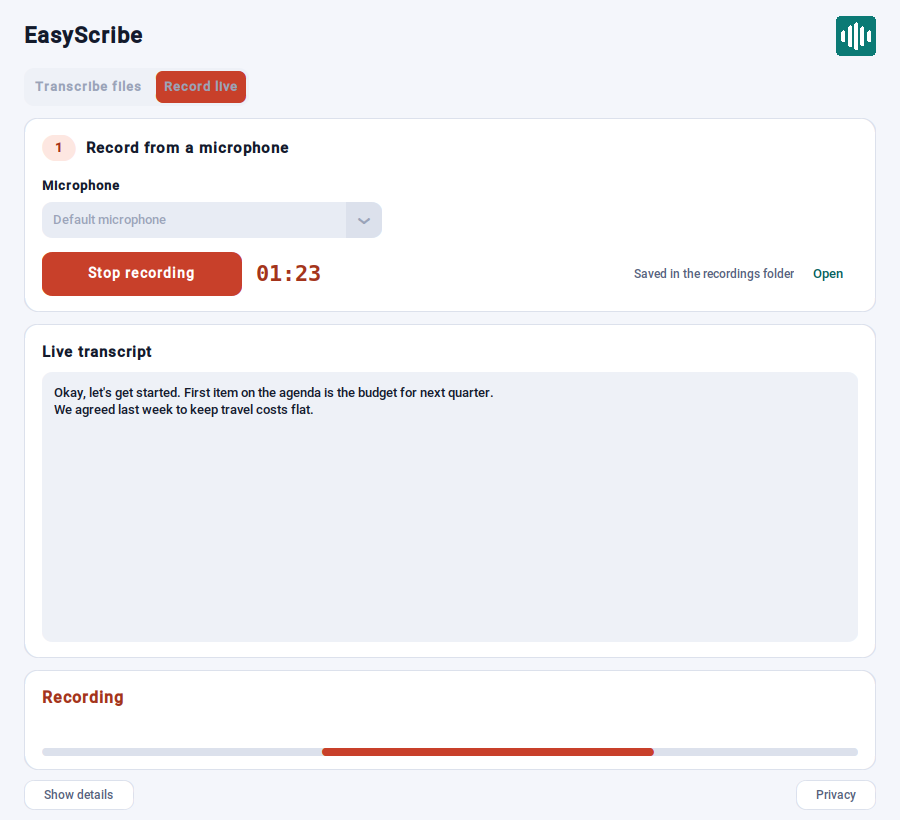
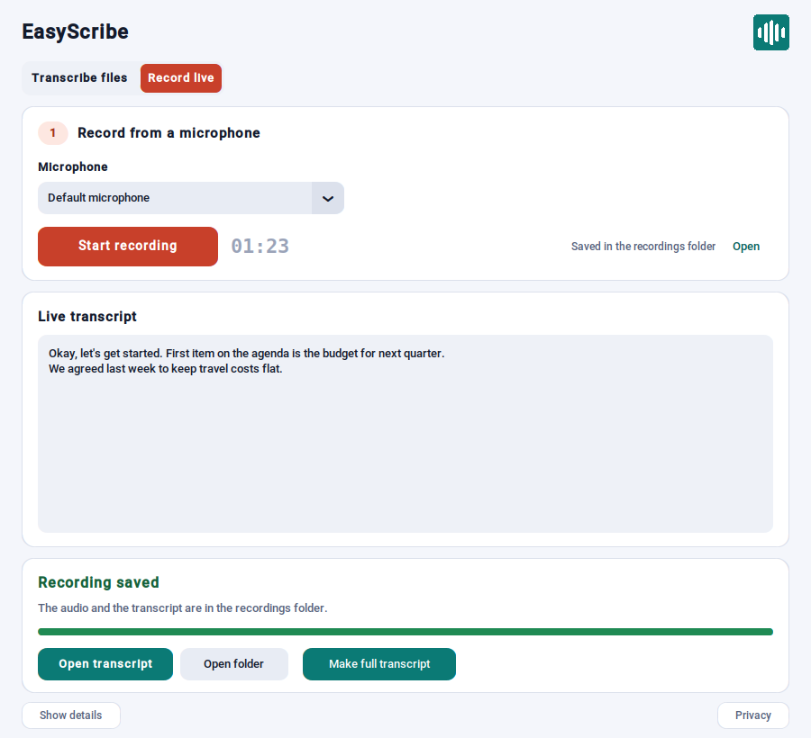
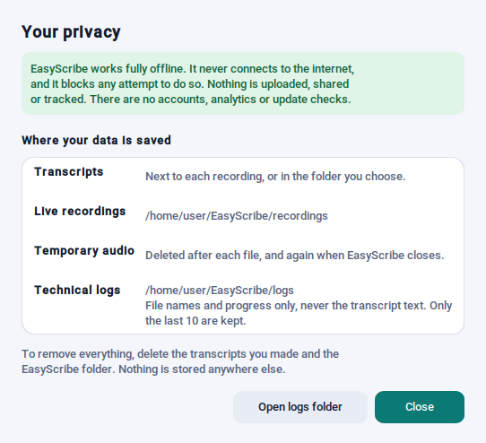

<p align="center">
  
</p>

<h1 align="center">EasyScribe</h1>

<p align="center">
  <b>Turn recordings into text — privately, on your own computer.</b><br>
  Meetings, interviews, lectures and live speech. No internet, no account, no upload.
</p>

<p align="center">
  
</p>

---

## Why EasyScribe?

- 🔒 **Nothing leaves your computer.** EasyScribe works fully offline. Your audio and transcripts stay on your disk. There are no accounts, no analytics and no update checks.
- 📁 **Transcribe any recording.** Audio or video, one file or many at a time.
- 🎙️ **Transcribe as you talk.** Record from your microphone and watch the words appear.
- 🗣️ **Know who said what.** EasyScribe can find the different speakers, and you can give them names.
- ⚡ **Fast on most PCs.** It uses your graphics card (NVIDIA, AMD or Intel) when it can, and your processor when it cannot.
- 📦 **One file, no setup wizard.** Download one `.exe`, double-click it, and start. No admin rights needed.

---

## What it looks like

### Transcribe files

Drag your files onto the window, or select **Choose files**. Then tick the options you want and select **Transcribe**.

Each colour means one thing everywhere in the app: **teal** for files, **coral** for recording, **amber** for speakers, **blue** for timestamps and **green** for done.

<p align="center">
  
</p>

You see the status of each file and the current step. You can stop at any time. If one file fails, the others continue.

<p align="center">
  
</p>

When it is done, open the transcript or the folder with one click. Each transcript is a plain `.txt` file next to its recording (or in a folder you choose).

### Name the speakers

Tick **Name the speakers** to find who is talking. When the speakers are found, a small window opens. Play a short sample of each voice and type a name. The names go into the transcript.

<p align="center">
  
</p>

### Record live

Select **Record live**, choose your microphone and select **Start recording**. The words appear as you speak.

<p align="center">
  
</p>

When you stop, EasyScribe saves the audio and the live transcript. For the best result, select **Make full transcript**. This runs the full recording through the more accurate file engine and saves it as a separate `(full).txt` file.

<p align="center">
  
</p>

If your computer stops during a recording, EasyScribe offers to recover the audio the next time it opens.

### Your privacy

Select **Privacy** at the bottom of the window to see what EasyScribe stores and where.

<p align="center">
  
</p>

---

## Get started

1. Download `EasyScribe-<version>-whisper.exe` from the [Releases](../../releases) page.
2. Put it in a folder of your choice. A local folder or a USB stick are both good.
3. Double-click it. A small **Getting ready** window shows while the `.exe` unpacks itself. The first time, this can take up to a minute.
4. Choose where to put EasyScribe (or keep the default) and select **Install**. This takes about 30 seconds and adds Desktop and Start Menu shortcuts.
5. Next time, open EasyScribe from the shortcut. It starts in about one second.

> **Windows SmartScreen:** EasyScribe is not code-signed yet, so Windows may show a warning the first time. Select **More info → Run anyway**.

### Update to a new version

Close EasyScribe, then double-click the new `.exe`. It finds your older version and asks first. Select **Update and open** to update it in place, or **Browse** to install in a different folder. Your recordings and logs are kept. If something goes wrong during the update, the previous version is restored.

### Take it with you

EasyScribe is portable. It does not use the registry and does not need admin rights. To move it, copy the `.exe` and the `EasyScribe` folder next to it.

---

## What you get

| Option | Example output |
|---|---|
| Plain text | `Hello, this is the first sentence. And here is another.` |
| **Add timestamps** | `[00:00:14]` at the start of each block of speech |
| **Name the speakers** | `[Alice]` / `[Bob]` at each change of speaker |

With both options:

```
[00:00:01] [Alice]
Hello, this is the first sentence.

[00:00:14] [Bob]
After a pause, the next block starts here.
```

**Supported files:** mp4, mkv, mov, avi, webm, mp3, wav, m4a, flac, ogg, opus, aac.

---

## Troubleshooting

| Problem | What to do |
|---|---|
| SmartScreen blocks the `.exe` | Select **More info → Run anyway**. The app is not signed yet. |
| "Close EasyScribe" message during an update | EasyScribe is still open. Close it, then select **Update and open** again. |
| "Model files missing" when it starts | Run the `.exe` again. The first install may have been stopped. |
| **Name the speakers** is grey | The speaker models are missing. Run the `.exe` again. |
| No microphones in the list | Check your microphone in the Windows sound settings. |
| Antivirus flags the `.exe` | Some antivirus tools flag PyInstaller apps by mistake. Add an exclusion. |
| Transcription is slow | Without a supported graphics card, EasyScribe uses the processor. Long files take longer. **Details** shows which device is used. |

---
---

# Technical details

The sections below are for developers and IT staff.

## Inference engines

| Task | Engine | Device |
|---|---|---|
| File transcription | [whisper.cpp](https://github.com/ggml-org/whisper.cpp) `whisper-cli`, large-v3-turbo q5_0, beam size 5 | Vulkan GPU (any vendor), else CPU |
| File transcription (fallback) | [sherpa-onnx](https://github.com/k2-fsa/sherpa-onnx) Whisper large-v3-turbo int8, VAD + greedy | CPU |
| Live transcription | sherpa-onnx, Silero VAD chunks | CPU |
| Speaker diarization | sherpa-onnx: pyannote segmentation-3.0 + WeSpeaker ResNet34-LM | CPU |

The device that whisper.cpp actually used is read from its own stderr and shown in the log. It is never assumed from build flags. sherpa-onnx 1.13.2 has no Vulkan provider, so the sherpa-onnx tasks stay on CPU (see `CLAUDE.md`, Rule 7).

Audio is decoded with the bundled ffmpeg to 16 kHz mono. Live recordings write raw PCM plus a JSON sidecar, so `recovery.py` can rebuild a WAV after a crash.

## Offline guarantee and privacy (GDPR)

EasyScribe never sends data off the computer. How this is enforced:

- **All models are local.** They load from absolute paths in the install folder. There are no HuggingFace Hub downloads.
- **Network access is blocked in the process.** `src/offline_guard.py` runs first in `main.py`, before any other import. It refuses every socket connection and DNS lookup that is not to loopback, disables proxies (`NO_PROXY=*`) and sets the usual opt-out variables (`HF_HUB_OFFLINE`, `DO_NOT_TRACK`, ...). A blocked attempt is logged.
- **ffmpeg and ffprobe read local files only.** They run with `-protocol_whitelist file`, so a playlist or concat file cannot make them fetch a URL.
- **No network code.** `tests/test_offline_guard.py` fails if a module in `src/` or `launcher/` imports a network library (`urllib`, `http`, `requests`, `webbrowser`, ...).
- **Temporary audio is deleted.** Converted WAV files and whisper.cpp output are removed after each file, at startup and at exit.

| Data | Location | Kept until |
|---|---|---|
| Transcripts | Next to each recording, or the folder you choose | You delete them |
| Live recordings | `recordings/` in the install folder | You delete them |
| Technical logs | `logs/` in the install folder. File names and progress only, never transcript text | The last 10 are kept |

To remove all data, delete your transcripts and the `EasyScribe` folder.

## Distribution and install layout

```
EasyScribe-<version>-whisper.exe   (launcher.exe, PyInstaller one-file)
  └── app.bundle                   (zip: EasyScribe.exe + _internal/ + models/ + whispercpp/ + ffmpeg/)
```

The launcher extracts `app.bundle` once, into an `EasyScribe\` folder:

```
EasyScribe\
  EasyScribe.exe
  .easyscribe-install.json   <- install marker (version, shortcuts)
  _internal\                 <- PyInstaller runtime (DLLs, .pyd files, assets)
  models\
    whisper\                 <- sherpa-onnx Whisper large-v3-turbo int8
    diarization\             <- segmentation.onnx, embedding.onnx
    silero_vad.onnx
  whispercpp\                <- whisper-cli.exe, ggml-large-v3-turbo-q5_0.bin, *.dll
  ffmpeg\                    <- ffmpeg.exe, ffprobe.exe
  recordings\                <- live recordings and their transcripts (user data)
  logs\                      <- rotating log files (user data)
  temp\                      <- temporary WAV files (auto-cleaned)
```

**Updates.** The launcher compares the version in the install marker with its own version:

- Same or newer install: it opens the installed `EasyScribe.exe` directly. It never downgrades.
- Older install: it shows the installer window and waits. Only when the user selects **Update and open** does it move the app files to `.easyscribe-old\`, extract the new files, then delete the backup. On any failure, the backup is moved back. `recordings\` and `logs\` are never moved. If a file is locked (the app is open), the update stops and the user is told to close EasyScribe.
- If an update is interrupted (power loss), the next start restores the backup first.

**Start-up splash.** The PyInstaller one-file bootloader unpacks `app.bundle` (about 1.5 GB) to `%TEMP%` before any Python code runs. This can take a minute. A PyInstaller `Splash` (`assets/splash.png`) shows at once during that time; the launcher closes it when its own window opens.

**Why not a "no-extract" single exe?** whisper-cli, ffmpeg and the models (about 1.5 GB) must be real files on disk. A one-file app that unpacks to `%TEMP%` at each start would copy 1.5 GB every time. Extract-once keeps start-up at about one second and still needs no installer, registry or admin rights.

## Project layout

```
src/
  main.py                Entry point: offline guard, logging, orphan recovery, GUI
  offline_guard.py       Blocks all non-loopback network access (imported first)
  config.py              Paths, constants and APP_VERSION
  common.py              Shared helpers (CancelledError, ...)
  logger.py              Rotating log file setup
  ffmpeg_wrapper.py      Subprocess ffmpeg/ffprobe with cancellation polling
  transcriber.py         File transcription (whisper.cpp if bundled, else sherpa-onnx)
  whispercpp_wrapper.py  Subprocess whisper-cli: beam search, Vulkan/CPU device log
  diarizer.py            sherpa-onnx speaker diarization
  mic_recorder.py        sounddevice capture + crash-safe PCM writer
  live_transcriber.py    Silero VAD loop + OfflineRecognizer for live mode
  recovery.py            Orphaned .pcm scanner and WAV recovery
  gui.py                 CustomTkinter UI with threaded workers
  win_paint.py           Windows only: paints window backgrounds at once (no black blocks)

launcher/
  launcher.py            Extract-once installer and version-aware updater
  launcher.spec          PyInstaller one-file spec for the launcher

assets/
  EasyScribe.ico/.png    App icon (both .exe files, all windows, shortcuts)
  make_icon.py           Regenerates the icon from the logo design (needs Pillow)
  splash.png             "Getting ready" window shown while the .exe unpacks
  make_splash.py         Regenerates splash.png (needs Pillow and customtkinter)
  version_resource.py    Windows file-version info for both specs, from APP_VERSION

tests/                   Fast offline checks; run all with `python tests/run_all.py`
```

## Building

Releases are built by GitHub Actions: **Actions → Build and Publish Release**, with the tag `v` + `APP_VERSION`. The workflow:

1. Installs the pinned Python dependencies from `requirements.txt` and runs the unit tests.
2. Downloads the models and ffmpeg.
3. Builds `whisper-cli` with `-DGGML_VULKAN=ON` and checks that it starts.
4. Runs PyInstaller for the app and validates the result (`tests/validate_build.py`).
5. Assembles the app folder, validates it again and checks that the bundled `whisper-cli` starts.
6. Packs `app.bundle` into the launcher and publishes the release.

The version is set in one place: `APP_VERSION` in `src/config.py`. Keep `VERSION` in `launcher/launcher.py` the same; `tests/test_version.py` checks this.

| Requirement (build machine) | Notes |
|---|---|
| Windows 10/11 64-bit | Build and target platform |
| Python 3.11 | Used by CI |
| Internet access | Only during the build, to get models and tools |

Before you change packaging, read `CLAUDE.md`. It lists the rules learned from earlier build failures.

---

## License

This project is released under the MIT License.

FFmpeg is included under the GPL v3 license. See https://ffmpeg.org/legal.html

whisper.cpp is MIT-licensed. sherpa-onnx and its bundled models (Whisper large-v3-turbo, pyannote segmentation-3.0 ONNX export, WeSpeaker ResNet34-LM embedding, Silero VAD) are subject to their own license terms. See https://github.com/k2-fsa/sherpa-onnx
